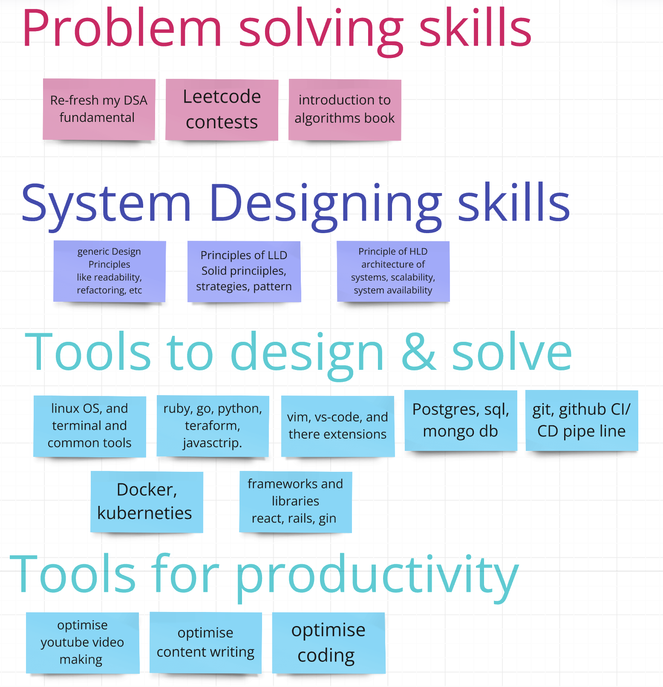

# Daily logs
this repos is made so i can track my daily logs.

## Areas of improvement
As a software developer here are 4 areas on which i need to work constantly.

## schedule for me
Daily only make one video that includes update of what i learnt today and tick mark my daily highlights.

1. daily read problem solving, system design, and tool to design & solve, tools for productivity. 
2. Try to use the tools in designing and solving problems fast.
3. after reading each as per the highlights, in night daily update refactor the content.
4. after updating content in all repos those on which i have read something.
5. now create a video showing what have  you achieved today and how many of the highlights have been finished.
6. now make highlights for next day and push the all repos with fresh-codeman.
